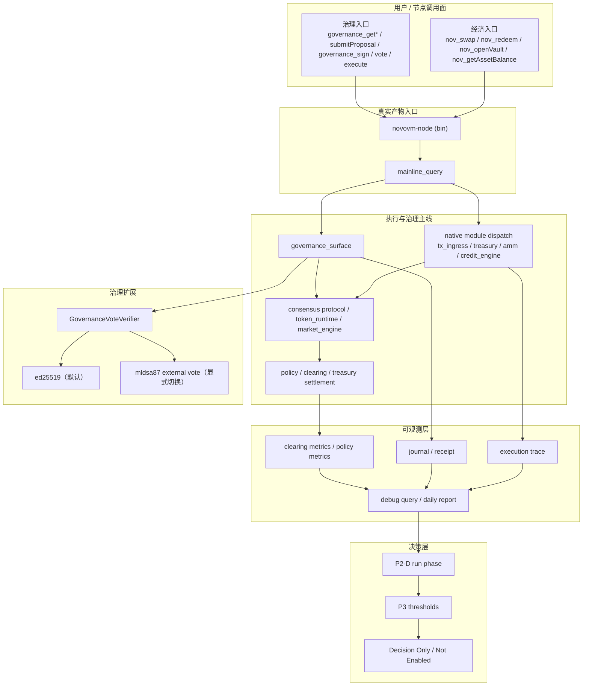

# NOVOVM 当前系统完整架构图（2026-04-19）

Status: AUTHORITATIVE OVERVIEW  
Scope: 执行层 + 经济用户入口 + 治理用户入口 + 抗量子扩展 + 可观测层 + P3 决策层

## 目的

本文件用于把当前 NOVOVM 的系统结构一次性讲清楚，只展示当前有效结果，不再要求外部读者自行拼接历史阶段文档。

## 当前系统状态（冻结口径）

- 执行层：已完成并进入真实 `novovm-node` 主线产物
- 经济用户入口：已完成并封盘
- 治理基础入口（读 / 写 / 执行 / sign）：已完成并封盘
- 治理扩展（`mldsa87 external vote`）：已完成并封盘
- 可观测层（trace + metrics + debug query）：已完成并封盘
- P3：`Decision Only / Not Enabled`

## 当前系统完整架构图

## 分层说明

### 1）执行层

执行层是当前系统的核心收口面。

- 真实产物入口统一为 `novovm-node`
- 查询与用户入口统一经由 `mainline_query`
- 原生经济能力统一走 `native module dispatch`
- 主线执行统一回到 `consensus protocol / token_runtime / market_engine`

这意味着当前执行语义不再分散在旧 RPC、dead `main.rs` 或平行入口中。

### 2）经济用户入口

当前已封盘的经济入口为：

- `nov_swap`
- `nov_redeem`
- `nov_openVault`
- `nov_getAssetBalance`

这些入口已经进入真实 `novovm-node`，并统一进入 `tx_ingress -> native module -> policy / clearing / treasury` 主线。

### 3）治理用户入口

当前已封盘的治理基础入口为：

- `governance_getPolicy`
- `governance_getProposal`
- `governance_listProposals`
- `governance_listAuditEvents`
- `governance_listChainAuditEvents`
- `governance_submitProposal`
- `governance_sign`
- `governance_vote`
- `governance_execute`

这些入口已经统一进入 `novovm-node -> mainline_query -> governance_surface -> consensus protocol`。

### 4）治理扩展层

当前治理扩展已经支持第二条验签路径，但保持受控边界：

- 默认路径：`ed25519`
- 扩展路径：显式切换到 `mldsa87 external vote`
- 当前 verifier 边界：单 `active verifier`

当前明确不支持：

- mixed verifier
- 本地 `mldsa87 governance_sign`

### 5）可观测层

可观测层不改变执行语义，只记录并导出主线事实：

- execution trace
- journal / receipt
- clearing metrics summary
- policy metrics summary
- debug query
- P2-D 日报 / 周报输入

这层的作用是把运行事实沉淀成后续 P3 判断依据，而不是直接放开 P3。

### 6）决策层

当前系统已经进入“可运行、可观测、可判定”的阶段。

- P2-D：已封盘并进入 run phase
- P3：只保留决策规范与门槛，不默认启用
- 当前状态：`Decision Only / Not Enabled`

因此，系统当前的正确推进方式不是继续扩功能，而是基于运行数据做启用/不启用判断。

## 当前系统边界

以下边界仍然有效：

- 不启用 mixed verifier
- 不启用本地 `mldsa87 governance_sign`
- 不启用 P3 multi-hop / split routing
- 不恢复旧 gov RPC 作为主入口
- 不恢复 dead `main.rs` 作为真实入口

## 对外统一表述

建议对外统一写成：

`NOVOVM 当前已经形成完整产品级系统：执行层、经济用户入口、治理用户入口、治理抗量子扩展、可观测层均已进入真实主线产物；P3 保持 Decision Only / Not Enabled，并基于运行数据决策。`

## 对应权威文档

- `docs_CN/NOVOVM-NETWORK/NOVOVM-NATIVE-TX-AND-EXECUTION-INTERFACE-DESIGN-2026-04-17.md`
- `docs_CN/NOVOVM-NETWORK/NOVOVM-NATIVE-PAYMENT-AND-TREASURY-P1-SEAL-2026-04-17.md`
- `docs_CN/NOVOVM-NETWORK/NOVOVM-CLEARING-ROUTER-P2A-SEAL-2026-04-17.md`
- `docs_CN/NOVOVM-NETWORK/NOVOVM-TREASURY-POLICY-P2C-SEAL-2026-04-18.md`
- `docs_CN/NOVOVM-NETWORK/NOVOVM-OBSERVABILITY-P2D-SEAL-2026-04-18.md`
- `docs_CN/NOVOVM-NETWORK/NOVOVM-NATIVE-ECONOMIC-USER-SURFACE-SEAL-2026-04-18.md`
- `docs_CN/NOVOVM-NETWORK/NOVOVM-GOVERNANCE-USER-SURFACE-SEAL-2026-04-18.md`
- `docs_CN/NOVOVM-NETWORK/NOVOVM-GOVERNANCE-MLDSA87-EXTERNAL-VOTE-SEAL-2026-04-18.md`
- `docs_CN/NOVOVM-NETWORK/NOVOVM-P3-FEATURE-GATE-DECISION-THRESHOLDS-2026-04-18.md`
