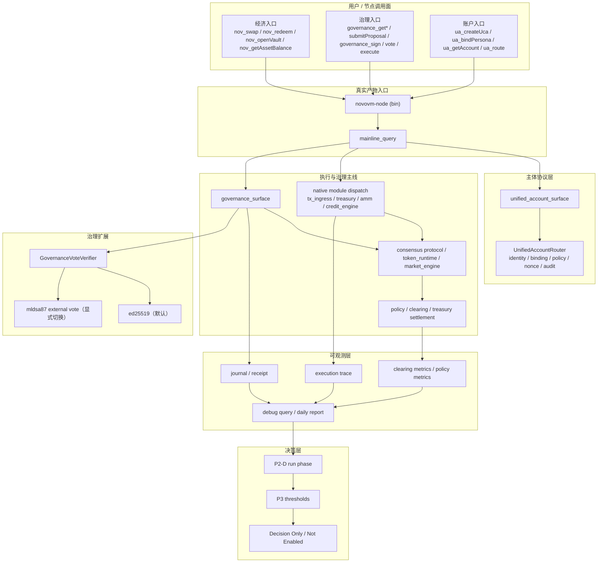

# NOVOVM 当前系统完整架构图（2026-04-19）

Status: AUTHORITATIVE OVERVIEW  
Scope: 统一账户主体协议 + 执行层 + 经济用户入口 + 治理用户入口 + 抗量子扩展 + 可观测层 + P3 决策层

## 目的

本文件用于把当前 NOVOVM 的系统结构一次性讲清楚，只展示当前有效结果，并给出当前读取顺序。

## 当前系统状态（冻结口径）

- 执行层：已完成并进入真实 `novovm-node` 主线产物
- 统一账户主体协议：已完成并进入真实 `novovm-node` 主线产物
- 统一账户/资产线：已形成稳定基线，可长期运行，不做默认结构性推进
- 经济用户入口：已完成并封盘
- 治理基础入口（读 / 写 / 执行 / sign）：已完成并封盘
- 治理扩展（`mldsa87 external vote`）：已完成并封盘
- 可观测层（trace + metrics + debug query）：已完成并封盘
- P3：`Decision Only / Not Enabled`

## 当前系统完整架构图

```mermaid
flowchart TB
    subgraph U["用户 / 节点调用面"]
        U1["经济入口<br/>nov_swap / nov_redeem / nov_openVault / nov_getAssetBalance"]
        U2["治理入口<br/>governance_get* / submitProposal / governance_sign / vote / execute"]
        U3["账户入口<br/>ua_createUca / ua_bindPersona / ua_getAccount / ua_route"]
    end

    subgraph E["真实产物入口"]
        E1["novovm-node (bin)"]
        E2["mainline_query"]
    end

    subgraph A["主体协议层"]
        A1["unified_account_surface"]
        A2["UnifiedAccountRouter<br/>identity / binding / policy / nonce / audit"]
    end

    subgraph X["执行与治理主线"]
        X1["native module dispatch<br/>tx_ingress / treasury / amm / credit_engine"]
        X2["governance_surface"]
        X3["consensus protocol / token_runtime / market_engine"]
        X4["policy / clearing / treasury settlement"]
    end

    subgraph Q["治理扩展"]
        Q1["GovernanceVoteVerifier"]
        Q2["ed25519（默认）"]
        Q3["mldsa87 external vote（显式切换）"]
    end

    subgraph O["可观测层"]
        O1["execution trace"]
        O2["journal / receipt"]
        O3["clearing metrics / policy metrics"]
        O4["debug query / daily report"]
    end

    subgraph D["决策层"]
        D1["P2-D run phase"]
        D2["P3 thresholds"]
        D3["Decision Only / Not Enabled"]
    end

    U1 --> E1
    U2 --> E1
    U3 --> E1
    E1 --> E2
    E2 --> A1
    E2 --> X1
    E2 --> X2
    A1 --> A2
    X1 --> X3
    X2 --> X3
    X3 --> X4
    X1 --> O1
    X2 --> O2
    X4 --> O3
    O1 --> O4
    O2 --> O4
    O3 --> O4
    O4 --> D1
    D1 --> D2
    D2 --> D3
    X2 --> Q1
    Q1 --> Q2
    Q1 --> Q3
```

## 分层说明

### 1）执行层

执行层是当前系统的核心收口面。

- 真实产物入口统一为 `novovm-node`
- 查询与用户入口统一经由 `mainline_query`
- 原生经济能力统一走 `native module dispatch`
- 主线执行统一回到 `consensus protocol / token_runtime / market_engine`

这意味着当前执行语义不再分散在旧 RPC、dead `main.rs` 或平行入口中。

### 2）统一账户主体协议

当前统一账户已经进入真实主线入口，并形成当前最小主体协议面：

- 真实路径：`novovm-node -> mainline_query -> unified_account_surface -> UnifiedAccountRouter`
- 当前规范主体：`account_id`
- 当前兼容别名：`uca_id`
- 当前已封盘方法：`ua_createUca / ua_rotatePrimaryKey / ua_setPolicy / ua_bindPersona / ua_revokePersona / ua_getBindingOwner / ua_getAuditEvents / ua_getAccount / ua_getPolicy / ua_listBindings / ua_getNextNonce / ua_route`

当前统一账户成立的是：

- 主体创建
- 派生地址 / persona 绑定与唯一性
- 策略与权限边界
- nonce 与重放保护
- 审计与持久化
- 统一资产视图读面：`account_balance / account_assets`
- `Cut A / KeyAlgo`
- `Cut C / ExecutionPolicy`

当前统一账户/资产线的稳定基线判断是：

`主体层 + 资产视图层 + KeyAlgo + ExecutionPolicy 已形成最小生产闭环；Cut B / AccountMode 默认 No-Go；Phase 4 继续保持触发式治理。`

当前统一账户不宣称：

- proof-root 账户树
- 统一资产账本
- 隐私子账户主实现
- 完整恢复状态机

### 3）经济用户入口

当前已封盘的经济入口为：

- `nov_swap`
- `nov_redeem`
- `nov_openVault`
- `nov_getAssetBalance`

这些入口已经进入真实 `novovm-node`，并统一进入 `tx_ingress -> native module -> policy / clearing / treasury` 主线。

### 4）治理用户入口

当前已封盘的治理基础入口为：

- `governance_getPolicy`
- `governance_getProposal`
- `governance_listProposals`
- `governance_listAuditEvents`
- `governance_listChainAuditEvents`
- `governance_submitProposal`
- `governance_sign`
- `governance_vote`
- `governance_execute`

这些入口已经统一进入 `novovm-node -> mainline_query -> governance_surface -> consensus protocol`。

### 5）治理扩展层

当前治理扩展已经支持第二条验签路径，但保持受控边界：

- 默认路径：`ed25519`
- 扩展路径：显式切换到 `mldsa87 external vote`
- 当前 verifier 边界：单 `active verifier`

当前明确不支持：

- mixed verifier
- 本地 `mldsa87 governance_sign`

### 6）可观测层

可观测层不改变执行语义，只记录并导出主线事实：

- execution trace
- journal / receipt
- clearing metrics summary
- policy metrics summary
- debug query
- P2-D 日报 / 周报输入

这层的作用是把运行事实沉淀成后续 P3 判断依据，而不是直接放开 P3。

### 7）决策层

当前系统已经进入“可运行、可观测、可判定”的阶段。

- P2-D：已封盘并进入 run phase
- P3：只保留决策规范与门槛，不默认启用
- 当前状态：`Decision Only / Not Enabled`

因此，系统当前的正确推进方式不是继续扩功能，而是基于运行数据做启用/不启用判断。

## 当前系统边界

以下边界仍然有效：

- 不启用 mixed verifier
- 不启用本地 `mldsa87 governance_sign`
- 不启用 P3 multi-hop / split routing
- 不宣称 proof-root 账户树已进入主线
- 不宣称统一账户资产账本已进入主线
- 不恢复旧 gov RPC 作为主入口
- 不恢复 dead `main.rs` 作为真实入口

## 对外统一表述

建议对外统一写成：

`NOVOVM 当前已经形成完整产品级系统：统一账户主线已完成主体层、资产视图层、密钥能力层与执行策略层的最小生产闭环，并进入可长期运行的稳定基线；执行层、经济用户入口、治理用户入口、治理抗量子扩展、可观测层均已进入真实主线产物；P3 保持 Decision Only / Not Enabled，并基于运行数据决策。`

## 对应权威文档

- `docs_CN/NOVOVM-NETWORK/NOVOVM-NATIVE-TX-AND-EXECUTION-INTERFACE-DESIGN-2026-04-17.md`
- `docs_CN/NOVOVM-NETWORK/NOVOVM-ACCOUNT-PROTOCOL-v1-2026-04-20.md`
- `docs_CN/NOVOVM-NETWORK/NOVOVM-ACCOUNT-PROTOCOL-v1-MIN-TO-v1-EVOLUTION-ROADMAP-2026-04-20.md`
- `docs_CN/NOVOVM-NETWORK/NOVOVM-NATIVE-PAYMENT-AND-TREASURY-P1-SEAL-2026-04-17.md`
- `docs_CN/NOVOVM-NETWORK/NOVOVM-CLEARING-ROUTER-P2A-SEAL-2026-04-17.md`
- `docs_CN/NOVOVM-NETWORK/NOVOVM-TREASURY-POLICY-P2C-SEAL-2026-04-18.md`
- `docs_CN/NOVOVM-NETWORK/NOVOVM-OBSERVABILITY-P2D-SEAL-2026-04-18.md`
- `docs_CN/NOVOVM-NETWORK/NOVOVM-NATIVE-ECONOMIC-USER-SURFACE-SEAL-2026-04-18.md`
- `docs_CN/NOVOVM-NETWORK/NOVOVM-GOVERNANCE-USER-SURFACE-SEAL-2026-04-18.md`
- `docs_CN/NOVOVM-NETWORK/NOVOVM-GOVERNANCE-MLDSA87-EXTERNAL-VOTE-SEAL-2026-04-18.md`
- `docs_CN/NOVOVM-NETWORK/NOVOVM-P3-FEATURE-GATE-DECISION-THRESHOLDS-2026-04-18.md`
