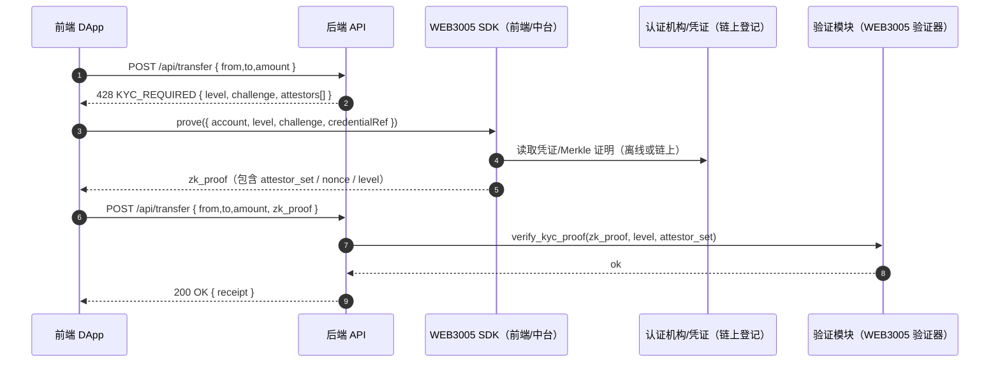

## 最小前后端交互流（KYC_REQUIRED 重试）

本节给出面向应用的最小交互流：当后端策略要求 KYC 且前端未提供证明时，后端返回 `KYC_REQUIRED`；前端调用 WEB3005 SDK 生成零知识证明后重试原请求。

### 序列图



说明：
- 推荐使用 `428 Precondition Required` 作为 HTTP 状态；也可用 403/409，需在 JSON 中返回 `error: "KYC_REQUIRED"`。
- `challenge` 应为服务端生成的短期随机挑战，绑定会话/路由/风控策略，防重放。
- 证明仅包含选择性披露属性与 attestor 签名，不含任何 PII。

### 后端接口示例（HTTP/JSON）

请求：

```http
POST /api/transfer
Content-Type: application/json

{
    "from": "0xA1...",
    "to":   "0xB2...",
    "amount": "1000000000000000000",
    "token": "SVM",
    "zk_proof": null
}
```

可能的响应：

```json
// 428: 需要 KYC 证明
{
    "error": "KYC_REQUIRED",
    "required_level": "standard", // 或 high/aml
    "challenge": "0x7c4e...",
    "attestors": [
        { "id": "did:svm:attestor:bankX", "policy": ["standard"] },
        { "id": "did:svm:attestor:partnerY", "policy": ["standard","high"] }
    ],
    "ttl": 300
}
```

```json
// 200: 成功（携带 zk_proof 重试后）
{
    "receipt": {
        "tx_hash": "0x...",
        "from": "0xA1...",
        "to": "0xB2...",
        "amount": "1000000000000000000",
        "timestamp": 1731800000
    }
}
```

### 前端最小实现（TypeScript）

```ts
import { proveKycLevel } from "@supervm/web3005"; // SDK 草案接口

type TransferReq = { from: string; to: string; amount: string; token: string; zk_proof?: any };

async function transfer(req: TransferReq) {
    const res = await fetch("/api/transfer", {
        method: "POST",
        headers: { "Content-Type": "application/json" },
        body: JSON.stringify(req),
    });

    if (res.status === 428) {
        const data = await res.json();
        if (data?.error === "KYC_REQUIRED") {
            const proof = await proveKycLevel({
                account: req.from,
                level: data.required_level,
                challenge: data.challenge,
                attestors: data.attestors,
            });
            return transfer({ ...req, zk_proof: proof }); // 带证明重试
        }
    }

    if (!res.ok) throw new Error(await res.text());
    return res.json();
}
```

### 后端最小实现（Node/Express，伪代码）

```ts
import express from "express";
import { verifyKycProof, kycPolicyForRoute } from "@supervm/web3005/server"; // 验证器草案接口

const app = express();
app.use(express.json());

app.post("/api/transfer", async (req, res) => {
    const { from, to, amount, token, zk_proof } = req.body || {};
    const policy = kycPolicyForRoute("/api/transfer");

    if (policy.enabled && !zk_proof) {
        const challenge = generateChallenge({ from, to, amount });
        return res.status(428).json({
            error: "KYC_REQUIRED",
            required_level: policy.level,
            challenge,
            attestors: policy.attestors,
            ttl: 300,
        });
    }

    if (policy.enabled) {
        const ok = await verifyKycProof({
            proof: zk_proof,
            level: policy.level,
            attestors: policy.attestors,
            challenge: getChallengeBoundToReq(req),
        });
        if (!ok) return res.status(400).json({ error: "INVALID_KYC_PROOF" });
    }

    const receipt = await executeTransfer({ from, to, amount, token });
    return res.json({ receipt });
});
```

### Rust 服务端校验（伪代码）

```rust
pub fn transfer(req: TransferReq, ctx: Ctx) -> HttpResponse {
        let policy = kyc::policy_for("/api/transfer");
        if policy.enabled && req.zk_proof.is_none() {
                let challenge = kyc::issue_challenge(&ctx, &req);
                return HttpResponse::new(428).json(json!({
                        "error": "KYC_REQUIRED",
                        "required_level": policy.level,
                        "challenge": challenge,
                        "attestors": policy.attestors,
                        "ttl": 300
                }));
        }

        if policy.enabled {
                let proof = req.zk_proof.ok_or(HttpError::bad_request("MISSING_PROOF"))?;
                kyc::verify_proof(&proof, &policy, ctx.challenge_for(&req))
                        .map_err(|_| HttpError::bad_request("INVALID_KYC_PROOF"))?;
        }

        let receipt = token::transfer(req.from, req.to, req.amount, req.token)?;
        HttpResponse::ok().json(json!({ "receipt": receipt }))
}
```

### 错误码建议

- `KYC_REQUIRED`: 缺少满足策略的 KYC 证明（返回 428）。
- `INVALID_KYC_PROOF`: 证明无效或与 challenge 不匹配（返回 400）。
- `KYC_LEVEL_TOO_LOW`: 证明等级低于该路由要求（返回 403）。

以上交互与本标准已定义的接口保持一致：前端使用 `proveKycLevel` 生成证明；后端使用 `verifyKycProof` 校验。实现可由团队 SDK/服务端库提供，链上仅保存必要的 attestor 元数据与可验证根承诺。

---

## 应用集成：KYC 开关与策略（可选，默认关闭）

 - 默认策略：KYC 为可选、用户自愿，默认无需启用。
 - 建议以“全局默认 + 细粒度策略”的方式控制：
     - `defaultRequired = false`
     - `routePolicies = { "defi.borrow": { "minLevel": 2 }, "fiat.withdraw": { "minLevel": 3 } }`

### 环境变量（PowerShell 示例）

```powershell
# 全局默认：不要求 KYC
$env:KYC_DEFAULT_REQUIRED = "false"

# 路由策略：JSON 字符串（按业务域/接口粒度设置）
$env:KYC_ROUTE_POLICIES = '{
    "routes": {
        "defi.borrow": { "minLevel": 2 },
        "fiat.withdraw": { "minLevel": 3 }
    }
}'
```

### TypeScript（后端伪代码）

```ts
const defaultRequired = process.env.KYC_DEFAULT_REQUIRED === 'true';
const routePolicies = JSON.parse(process.env.KYC_ROUTE_POLICIES ?? '{"routes":{}}');

async function requireKyc(routeKey: string, did: string, providedProof?: Uint8Array) {
    const policy = routePolicies.routes?.[routeKey];
    if (!policy && !defaultRequired) return true;
    const minLevel = policy?.minLevel ?? 1;
    if (providedProof) {
        const ok = await identity.verify_kyc_proof(providedProof);
        if (!ok) throw new Error('KYC proof invalid');
        return true;
    }
    throw new Error(`KYC_REQUIRED:minLevel=${minLevel}`);
}

app.post('/defi/borrow', async (req, res) => {
    try {
        const did = req.user.did;
        const proof = req.body.kycProof ? hexToBytes(req.body.kycProof) : undefined;
        await requireKyc('defi.borrow', did, proof);
        res.json({ ok: true });
    } catch (e) { res.status(403).json({ error: String(e) }); }
});
```

### Rust（后端伪代码）

```rust
async fn require_kyc(route_key: &str, did: &str, provided_proof: Option<Vec<u8>>) -> anyhow::Result<()> {
        let default_required = std::env::var("KYC_DEFAULT_REQUIRED").ok().as_deref() == Some("true");
        let policies: std::collections::HashMap<String, u8> = load_policies(); // route_key -> min_level
        let min = policies.get(route_key).copied();
        if min.is_none() && !default_required { return Ok(()); }
        let min_level = min.unwrap_or(1);
        if let Some(proof) = provided_proof {
                let ok = identity.verify_kyc_proof(proof).await?;
                anyhow::ensure!(ok, "KYC proof invalid");
                return Ok(());
        }
        anyhow::bail!(format!("KYC_REQUIRED:minLevel={}", min_level));
}
```

要点：
 - 不把 KYC 作为全网强制门槛，保留匿名/化名的默认可用性。
 - 在确需合规的业务接口上，按最小化原则请求“等级阈值”证明（零知识），避免收集 PII。
 - 可在“地域/资产规模/业务类型”等维度动态开启策略；SDK 只需遵循 WEB3005 的证明/校验接口。

---

## Roadmap
# WEB3005: 身份与信誉系统标准

**版本**: v0.1.0  
**状态**: Draft  
**作者**: SuperVM Core Team  

---

## 设计理念

WEB3005 是去中心化身份（DID）+ 链上信誉系统，利用 zkVM 实现隐私保护的身份验证。

同时，它承担 SuperVM「统一账户模型」的规范职责：同一身份下既可使用公钥地址，也可领取/绑定数字账户，并与多链外部钱包地址建立可信映射，用于登录认证与钱包绑定。

默认策略（重要）：KYC 为可选、用户自愿。系统默认允许匿名/化名身份与统一账户正常使用；仅在特定 DApp/行业合规场景中，由应用选择启用 KYC 校验。KYC 采用零知识选择性披露，L1 不存放任何可识别 PII，链上仅保留摘要与有效性证明。

## 核心创新

| 传统 DID | **WEB3005** |
|---------|-------------|
| 公开身份信息 | ✅ **零知识证明身份** |
| 单链身份 | ✅ **跨链统一身份** |
| 静态信誉 | ✅ **AI 动态信誉评分** |

---

## Rust Trait 接口

```rust
#[async_trait::async_trait]
pub trait WEB3005Identity {
    // ============ DID 管理 ============
    
    /// 创建去中心化身份
    async fn create_did(
        &self,
        public_key: PublicKey,
        metadata: DIDMetadata,
    ) -> Result<DID, IdentityError>;
    
    /// 添加凭证（学历/资质证明）
    async fn issue_credential(
        &self,
        did: DID,
        credential_type: CredentialType,
        data: Vec<u8>,
        issuer: DID,
    ) -> Result<CredentialId, IdentityError>;
    
    /// 验证凭证（零知识证明）
    async fn verify_credential(
        &self,
        credential_id: CredentialId,
        zkp: ZkProof,
    ) -> Result<bool, IdentityError>;
    
    // ============ 信誉系统 ============
    
    /// 提交信誉评价
    async fn submit_reputation(
        &self,
        target_did: DID,
        score: u8,  // 0-100
        context: ReputationContext,
    ) -> Result<TransactionHash, IdentityError>;
    
    /// 查询信誉分数
    async fn get_reputation(
        &self,
        did: DID,
        context: Option<ReputationContext>,
    ) -> Result<u8, IdentityError>;
    
    /// AI 计算综合信誉
    async fn ai_calculate_reputation(
        &self,
        did: DID,
    ) -> Result<AIReputationScore, IdentityError>;
    
    // ============ 跨链身份 ============
    
    /// 同步 DID 到其他链
    async fn sync_did_cross_chain(
        &self,
        did: DID,
        target_chains: Vec<ChainId>,
    ) -> Result<Vec<TransactionHash>, IdentityError>;

    // ============ KYC / 实名凭证 ============

    /// 注册/管理 KYC 签发方（监管白名单/信誉评分可由治理决定）
    async fn register_attestor(
        &self,
        attestor_did: DID,
        metadata: AttestorMetadata,
    ) -> Result<(), IdentityError>;

    /// 注销/撤销签发方
    async fn revoke_attestor(&self, attestor_did: DID) -> Result<(), IdentityError>;

    /// 由签发方签发 KYC 凭证（不上链明文，仅存证摘要）
    async fn issue_kyc_credential(
        &self,
        subject: DID,
        level: u8,                // 1-5 等级
        evidence_hash: Vec<u8>,   // 原始材料哈希（链下/加密存储）
        expires_at: Option<u64>,
    ) -> Result<CredentialId, IdentityError>;

    /// 生成“达到 KYC 等级 X”的零知识证明（选择性披露）
    async fn prove_kyc_level(&self, did: DID, min_level: u8) -> Result<ZkProof, IdentityError>;

    /// 验证 KYC 零知识证明（不泄露具体信息）
    async fn verify_kyc_proof(&self, proof: ZkProof) -> Result<bool, IdentityError>;

    /// 撤销某个 KYC 凭证
    async fn revoke_kyc_credential(&self, credential_id: CredentialId) -> Result<(), IdentityError>;

    /// 查询 KYC 状态视图（仅返回等级/时间/签发方，不含 PII）
    async fn get_kyc_status(&self, did: DID) -> Result<KYCStatus, IdentityError>;

    /// 通过 KYC 校验后，将统一账户升级/分配到 KYC 段（4xx... 数字账户）
    async fn upgrade_to_kyc_numeric_id(
        &self,
        did: DID,
        target_level: u8,
    ) -> Result<u64, IdentityError>; // 返回分配的 12 位数字账户

    // ============ 统一账户与钱包绑定 ============

    /// 绑定 SuperVM 统一账户（公钥地址 ↔ 数字账户(12位)）
    /// - 要求提供相应签名以证明对公钥/数字账户的控制权
    async fn bind_unified_account(
        &self,
        did: DID,
        primary_pubkey20: Vec<u8>,          // 20字节公钥地址（与链上公钥地址兼容）
        optional_numeric_id12: Option<u64>, // 12位数字账户，例如 888888888888
        signature: Vec<u8>,
    ) -> Result<(), IdentityError>;

    /// 绑定外部链钱包（用于跨链统一登录/资产视图/跨链结算）
    /// - 通过对挑战串签名(外部链签名)完成地址所有权证明
    async fn link_external_wallet(
        &self,
        did: DID,
        chain_id: ChainId,
        external_address: Vec<u8>,
        challenge: Vec<u8>,
        signature: Vec<u8>,
    ) -> Result<(), IdentityError>;

    /// 解除绑定外部链钱包
    async fn unlink_external_wallet(
        &self,
        did: DID,
        chain_id: ChainId,
        external_address: Vec<u8>,
    ) -> Result<(), IdentityError>;

    /// 查询当前 DID 下的统一账户与关联钱包
    async fn get_account_linkage(
        &self,
        did: DID,
    ) -> Result<AccountLinkageView, IdentityError>;

    // ============ 登录 / 认证 ============

    /// 发起登录挑战（由前端请求、后端返回随机挑战）
    async fn issue_login_challenge(
        &self,
        did_or_numeric: String, // 可以是 DID 或 12位数字账户
    ) -> Result<Vec<u8>, IdentityError>; // challenge bytes

    /// 使用公钥或外部钱包签名挑战，换取登录令牌
    async fn authenticate_with_signature(
        &self,
        did: Option<DID>,
        chain_id: Option<ChainId>,         // None 代表用 SuperVM 公钥
        address_or_pubkey: Vec<u8>,
        challenge: Vec<u8>,
        signature: Vec<u8>,
    ) -> Result<LoginToken, IdentityError>;
}

#[derive(Debug, Clone, Serialize, Deserialize)]
pub enum CredentialType {
    Education,      // 学历
    Employment,     // 工作经历
    License,        // 执照
    Certificate,    // 证书
    Custom(String),
}

#[derive(Debug, Clone, Serialize, Deserialize)]
pub enum ReputationContext {
    Trading,        // 交易信誉
    Development,    // 开发者信誉
    Community,      // 社区贡献
    Financial,      // 金融信用
}

#[derive(Debug, Clone, Serialize, Deserialize)]
pub struct AIReputationScore {
    pub overall_score: u8,
    pub breakdown: HashMap<ReputationContext, u8>,
    pub trend: Trend,
}

#[derive(Debug, Clone, Serialize, Deserialize)]
pub enum Trend {
    Rising,
    Stable,
    Declining,
}

pub type DID = String;  // e.g., "did:supervm:0x123..."

#[derive(Debug, Clone, Serialize, Deserialize)]
pub struct AccountLinkageView {
    pub primary_pubkey20: Vec<u8>,          // 统一账户主标识（公钥地址）
    pub numeric_id12: Option<u64>,          // 统一账户数字ID（12位）
    pub external_wallets: Vec<(ChainId, Vec<u8>)>, // 已绑定外部链钱包
}

#[derive(Debug, Clone, Serialize, Deserialize)]
pub struct LoginToken {
    pub token: String,
    pub issued_at: u64,
    pub expires_at: u64,
}

#[derive(Debug, Clone, Serialize, Deserialize)]
pub struct AttestorMetadata {
    pub name: String,
    pub website: Option<String>,
    pub jurisdiction: Option<String>,  // 监管辖区
    pub contact: Option<String>,
}

#[derive(Debug, Clone, Serialize, Deserialize)]
pub struct KYCStatus {
    pub level: Option<u8>,
    pub verified_at: Option<u64>,
    pub verifier: Option<DID>,
    pub expires_at: Option<u64>,
}
```

---

## 应用场景

### **隐私身份验证**
### **KYC 门槛接入（选择性披露）**
```rust
// 用户生成“达到 KYC 等级≥2”的证明
let proof = identity.prove_kyc_level(my_did.clone(), 2).await?;
assert!(identity.verify_kyc_proof(proof).await?);

// 通过后，服务端授权访问或分配 KYC 数字账户段（4xx...）
let kyc_numeric = identity.upgrade_to_kyc_numeric_id(my_did, 2).await?;
```
### **统一登录（钱包/公钥/数字账户）**
```rust
// 1) 申请挑战
let challenge = identity.issue_login_challenge("888888888888".into()).await?;

// 2) 使用外部链钱包签名挑战（例如 Metamask/EVM）
let sig = evm_sign(&challenge, &my_evm_addr)?;

// 3) 验证并换取登录令牌
let token = identity.authenticate_with_signature(
    None,              // DID 可选
    Some(EVM_CHAIN_ID),
    my_evm_addr_bytes,
    challenge,
    sig,
).await?;
```
```rust
// 证明"我是成年人"但不泄露具体年龄
let zkp = identity.prove_age_over_18(my_did).await?;
assert!(identity.verify_credential(credential_id, zkp).await?);
```

---

## Roadmap

| 阶段 | 功能 | 状态 |
|------|------|------|
| **Phase 1** | DID 基础功能 | 📋 设计中 |
| **Phase 2** | zkVM 隐私凭证 | 📋 规划中 |
| **Phase 3** | AI 信誉评分 | 📋 规划中 |
| **Phase 4** | 跨链身份同步 | 📋 规划中 |
| **Phase 5** | KYC 签发方注册/撤销/证明 | 📋 规划中 |

---

## 与运行时统一账户实现的对齐

- 参考实现：`src/vm-runtime/src/adapter/account.rs`
    - `SuperVMAccountId` 支持两种形式：`PublicKey(Vec<u8>)` 与 `NumericId(u64, 12位)`。
    - `SuperVMAccount` 支持 `linked_accounts: HashMap<chain_id, address>` 用于外部链钱包绑定。
    - 提供 `claim_numeric_id()`、`link_account()`、`unlink_account()` 等方法。
    - `KYCInfo` 结构（加密/哈希存放姓名与证件号）与账户前缀段（4xx...）对应 KYC Verified。

> 本标准中的“统一账户/钱包绑定/登录”接口与运行时代码一一对应，应用可用 WEB3005 作为统一登录与钱包绑定的协议抽象层，上层 DApp 与其它协议（如 WEB30/WEB3009/WEB3014）可直接依赖该抽象。
